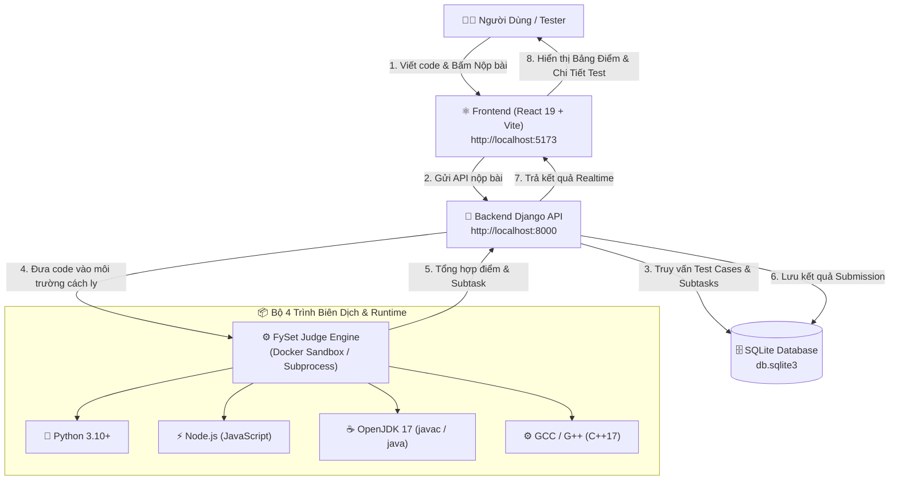

# 🌟 HƯỚNG DẪN TOÀN DIỆN HỆ THỐNG CHẤM BÀI FYSET (FYSET ONLINE JUDGE)

Tài liệu này hướng dẫn chi tiết từ A-Z về:
1. **Kiến trúc hệ thống** và cơ chế chấm bài tự động.
2. **Cách cài đặt và khởi chạy** (cả bằng Docker lẫn chạy Local).
3. **Cách làm bài và nộp bài** trên giao diện web.
4. **Bộ mã nguồn mẫu 4 ngôn ngữ** (Python, JavaScript, Java, C++) để test nhanh.
5. **Bảng giải thích các mã kết quả chấm** (AC, WA, TLE, CE, RE).
6. **Tài liệu API Backend** của hệ thống chấm.

---

## 🏗️ 1. Kiến Trúc Tổng Thể Hệ Thống



---

## 🚀 2. Hướng Dẫn Cài Đặt & Khởi Chạy

Bạn có thể lựa chọn **Cách 1 (Docker - Khuyên dùng)** hoặc **Cách 2 (Chạy trực tiếp Local)**:

---

### 🌟 CÁCH 1: Khởi chạy Trọn Gói bằng Docker (Khuyên Dùng)
> **Ưu điểm**: Tự động có sẵn trọn bộ compiler C++, Java 17, Node.js, Python 3 bên trong container. Người dùng **không cần cài thêm bất kỳ compiler nào vào máy tính**.

#### 📥 Bước 1.1: Cài đặt Docker Desktop (Nếu máy chưa có)
Nếu gõ `docker compose` mà báo lỗi chưa nhận diện lệnh, hãy cài Docker Desktop theo 1 trong 2 cách:
* **Cách nhanh qua Terminal**: Mở PowerShell chạy lệnh:
  ```powershell
  winget install Docker.DockerDesktop
  ```
* **Cách tải trực tiếp**: Vào trang chủ [docker.com/products/docker-desktop](https://www.docker.com/products/docker-desktop), tải file cài đặt `.exe` và nhấn Install.

*(Sau khi cài xong, hãy **mở ứng dụng Docker Desktop lên** từ Start Menu, đợi nó khởi động xong rồi tắt mở lại cửa sổ Terminal).*

#### 🚀 Bước 1.2: Bật Máy Chủ Chấm Bài
Mở Terminal tại thư mục gốc `learnflow-fe` và chạy:
```bash
docker compose up --build
```
*(Lần đầu Docker sẽ tự tải và cài đặt 4 ngôn ngữ trong 1-2 phút, các lần sau khởi động chỉ mất vài giây).*

#### 🔍 Bước 1.3: Kiểm tra máy chủ chấm bài
Truy cập: 👉 [http://localhost:8000/api/judge/system-status/](http://localhost:8000/api/judge/system-status/)  
*(Nếu trả về `available: true` cho cả 4 ngôn ngữ là hoàn tất!)*

#### 💻 Bước 1.4: Khởi chạy Frontend React
Mở một cửa sổ terminal mới và chạy:
```bash
npm run dev
```
Truy cập trình duyệt tại: 👉 **`http://localhost:5173`** để bắt đầu làm bài và nộp bài!

---

### 💻 CÁCH 2: Khởi chạy Trực Tiếp trên Máy (Local)
Nếu máy bạn đã có sẵn Python và các compiler:

1. **Khởi chạy Backend (Django)**:
   ```bash
   cd judgingsystem
   pip install -r requirements.txt
   python manage.py runserver 8000
   ```
2. **Khởi chạy Frontend (React Vite)**:
   ```bash
   # Mở cửa sổ terminal khác tại thư mục learnflow-fe
   npm install
   npm run dev
   ```
3. Truy cập website tại: 👉 **`http://localhost:5173`**

---

## 🧠 3. Cơ Chế Chấm Bài Tự Động (Automated Judging)

1. **100% Dữ Liệu Thực từ Database**: Hệ thống không dùng dữ liệu giả lập (mock data). Toàn bộ test case, subtask, điểm số đều được đọc trực tiếp từ bảng `judge_testcase` và `judge_problem` trong database `db.sqlite3`.
2. **Chuẩn hóa Kết quả (Output Normalization)**: Tự động loại bỏ khoảng trắng thừa cuối dòng và chuẩn hóa dấu xuống dòng (`\r\n` -> `\n`) để đảm bảo so khớp công bằng.
3. **Chấm theo Subtask**:
   * Mỗi Subtask gồm một nhóm các Test Case.
   * Bài nộp chỉ đạt trọn điểm của Subtask khi **vượt qua 100% tất cả các test case trong Subtask đó**.
4. **Kiểm Soát Tài Nguyên**:
   * Giới hạn thời gian chạy (**Time Limit** - mặc định `2.0s`).
   * Giới hạn bộ nhớ (**Memory Limit** - mặc định `256MB`).

---

## 📊 4. Bảng Giải Thích Mã Kết Quả Chấm (Verdicts)

| Mã | Tên Tiếng Anh | Ý Nghĩa | Nguyên Nhân Thường Gặp |
| :---: | :--- | :--- | :--- |
| **`AC`** | **Accepted** | Bài nộp hoàn toàn chính xác (Đạt 100% điểm). | Thuật toán đúng, thỏa mãn thời gian và bộ nhớ. |
| **`WA`** | **Wrong Answer** | Kết quả đầu ra không khớp với đáp án mẫu. | Sai thuật toán, sai định dạng output, thiếu trường hợp biên. |
| **`TLE`** | **Time Limit Exceeded** | Quá giới hạn thời gian chạy cho phép. | Vòng lặp vô tận, thuật toán có độ phức tạp thời gian quá lớn ($O(N^2)$ thay vì $O(N \log N)$). |
| **`CE`** | **Compilation Error** | Lỗi biên dịch cú pháp. | Sai cú pháp ngôn ngữ, quên import thư viện, thiếu dấu `;` hoặc sai tên Class trong Java. |
| **`RE`** | **Runtime Error** | Lỗi khi đang thực thi chương trình. | Chia cho 0, truy cập mảng ngoài phạm vi (Index Out of Bounds), tràn ngăn xếp (Stack Overflow). |

---

## 📝 5. Bộ Mã Nguồn Mẫu 4 Ngôn Ngữ (Test Bài Toán `#01: A + B`)

Đề bài: Cho 2 số nguyên $A$ và $B$ trên cùng một dòng (hoặc hai dòng). Hãy in ra tổng $A + B$.

### 1️⃣ Python 3
```python
import sys

def main():
    input_data = sys.stdin.read().split()
    if len(input_data) >= 2:
        a = int(input_data[0])
        b = int(input_data[1])
        print(a + b)

if __name__ == "__main__":
    main()
```

### 2️⃣ JavaScript (Node.js)
```javascript
const fs = require('fs');

function main() {
    const input = fs.readFileSync(0, 'utf-8').trim().split(/\s+/);
    if (input.length >= 2) {
        const a = parseInt(input[0], 10);
        const b = parseInt(input[1], 10);
        console.log(a + b);
    }
}

main();
```

### 3️⃣ Java (JDK 17)
> ⚠️ **Lưu ý**: Trong Java, luôn đặt tên class chính là `Main` và có hàm `public static void main(String[] args)`.
```java
import java.util.Scanner;

public class Main {
    public static void main(String[] args) {
        Scanner sc = new Scanner(System.in);
        if (sc.hasNextLong()) {
            long a = sc.nextLong();
            long b = sc.nextLong();
            System.out.println(a + b);
        }
    }
}
```

### 4️⃣ C++ (C++17)
```cpp
#include <iostream>

using namespace std;

int main() {
    ios_base::sync_with_stdio(false);
    cin.tie(NULL);
    
    long long a, b;
    if (cin >> a >> b) {
        cout << (a + b) << "\n";
    }
    return 0;
}
```

---

## 🧪 6. Bộ Mã Test Thử Các Lỗi Cố Tình (Để kiểm tra máy chấm)

| Loại Test | Ngôn Ngữ | Code Mẫu | Kết Quả Mong Đợi |
| :--- | :--- | :--- | :---: |
| **Test TLE** | Python | `import time; time.sleep(5)` | ⏱️ **TLE** |
| **Test WA** | C++ | `#include <iostream>\nint main(){ std::cout << -9999; }` | ❌ **WA** |
| **Test CE** | C++ | `int main() { syntax error }` | ⚠️ **CE** |
| **Test RE** | Python | `print(1 / 0)` | 💥 **RE** |

---

## 📡 7. Tài Liệu API Máy Chủ Chấm Bài (Endpoints)

Base URL: `http://localhost:8000/api/judge/`

| Phương thức | Endpoint | Chức năng | Body / Tham số |
| :--- | :--- | :--- | :--- |
| `GET` | `/system-status/` | Kiểm tra trạng thái 4 compiler trên server | Không |
| `POST` | `/submit/` | Nộp bài chấm chính thức (lưu DB) | `{"problem_id": 1, "language": "cpp", "source_code": "..."}` |
| `POST` | `/run-sample/` | Chạy thử nghiệm nhanh (không lưu DB) | `{"language": "python", "source_code": "...", "input": "2 3", "expected_output": "5"}` |
| `GET` | `/submission/<id>/` | Lấy chi tiết kết quả chấm của một bài nộp | ID bài nộp trên URL |
| `GET` | `/problems/` | Lấy danh sách tất cả bài tập | `?contest_id=<id>` (tùy chọn) |
| `GET` | `/problem/<id>/` | Lấy chi tiết bài tập, test case mẫu & subtask | ID bài tập trên URL |
| `POST` | `/problems/create/` | Tạo bài tập mới kèm test cases & subtasks | JSON bài tập đầy đủ |

---

## 🛠️ 8. Các Lệnh Quản Trị Hệ Thống Hữu Ích

```bash
# Xem log chấm bài của Docker theo thời gian thực
docker compose logs -f

# Dừng container Docker
docker compose down

# Xóa hoàn toàn container và image để giải phóng dung lượng ổ đĩa
docker compose down --rmi all

# Tạo lại dữ liệu mẫu / migration cho database
cd judgingsystem
python manage.py makemigrations
python manage.py migrate
```

---
*Phát triển bởi đội ngũ **FySet** • Bản quyền © 2026 FySet System.*
